# Spool — build progress

> **Living tracker. Read this first to resume.** Maintained as work proceeds, mapped to
> `Spool_Engineering-Spec.md` (§5 roadmap, §6 front-end standards). Status legend:
> ✅ done & verified · 🟡 in progress · ◻️ not started.
>
> **Last updated:** 2026-06-03 · **Phase 0 — ✅ · Phase 1 — ✅ · Phase 2 — ✅ COMPLETE** (all 4 spec
> done-whens + all 8 work-items: S7 reframe · S8 caption · transcript editing · S9 brand kits · library
> search · S6 editor timeline · **Settings config writes** · **perf/virtualization** + an explicit, shipped
> **FTS5** decision (additive trigram index). Engine **676 tests** + studio typecheck/lint/12 vitest/build
> + Playwright e2e all green).
> **Post-Phase-2 polish (live dogfooding, this session) — ✅ done:** honest transcribing state · Discovery
> tabs filter+accumulate+Merge-next · CORS PATCH/DELETE · **cut→review→render flow** (Make clips cuts→Clips
> tab; editor plays the real clip with live synced captions; Render burns) · editor aspect/Pan-Split-Center
> live preview · **per-shot face-tracking reframe quality stack** (YuNet + adaptive zoom + rule-of-thirds +
> stabilization + active-speaker + a measurement harness). Details in "Post-Phase-2 UX fixes" below.
> **▶ NEXT (new session, before Phase 3):** caption↔audio sync + diarization accuracy — see
> "Next session — caption sync + diarization" near the bottom. Then Phase 3 after more manual testing.
> **Backend** proven on real media (engine chain → `api_v1` → MCP/CLI → codex bridge + NL agent).
> **UI — ✅ pixel-1:1 port of `docs/Spool (standalone) (1).html`, wired to live `api_v1`, zero mock.**
> Every demo screen ported + screenshot-verified against the demo: Onboarding (S0), Home, Import,
> Library, Project/Transcript (S4), Discovery (S5), Reframe (S7), Caption (S8), Editor (S6),
> Queue (S10), Clips (S11), Settings, Brand, Publish/Analytics, **Agent panel + ⌘K palette +
> shortcuts + toasts**. Tailwind dropped; the old invented components deleted; `spool.css` (verbatim
> demo CSS) is the single styling source of truth. **Playwright e2e green** (paste URL → 9:16
> captioned clip through the real UI, ~49s). **Diarization-on reframe verified** on a real 2-speaker
> clip (`source=fused`, 2 speakers, 1080×1920 render). typecheck 9/9 · lint clean · build 16 routes.
>
> **Phase-1 §6 standards debt — ✅ closed:** §6.6 a11y (`--text-faint` darkened to clear WCAG AA;
> onboarding copy trimmed to one line); §6.5 per-route error boundaries (`error.tsx` +
> `global-error.tsx`); §6.3 continuous drag (ROI boxes + timeline trim) now ref-driven, no
> setState-per-pointermove; §6.3 design-system promoted to **`@spool/ui`**; §6.5 **vitest + RTL**
> unit/component tests (12 green: fmt/parse helpers, `mapCandidates`/`buildTranscript`, `CandidateCard`).
> Deliberate spec-over-1:1 calls per Kaivan: dropped Tailwind/shadcn for verbatim `spool.css`; applied
> the §6.6 a11y deviations. **Deferred to Phase 2 (per §6.7):** list virtualization + lazy-loading the
> heavy editor. **Decided, not debt:** offline moment-finding (Codex bridge needs network — the locked
> default; a local LLM provider can be wired later).
>
> **Post-Phase-1 hardening (also done, all verified — typecheck/lint/test/e2e green):**
> (1) **Code review** — fixed 10 correctness/UX bugs: paused downloads now map + show Resume; the
> Editor's *latest* render is openable; Editor Render honors the chosen aspect/reframe/preset; Discovery
> selection resets cleanly on a new find (keyed); Editor `aspect` seeds from the real clip (keyed
> EditorBody + loading gate, no "not found" flash); Queue retry/dismiss/transcribe actions are
> domain-aware (no retry-that-deletes, no dead buttons); elicitation ids are a monotonic ref (no
> collisions); answerElicit re-sends sourceId; ⌘K works under Caps Lock. (2) **Wired 3 demo-faithful
> dead controls** — Discovery "Adjust in/out" (editable MM:SS:FF, persists a per-candidate range
> override used by render); Clips bulk **Export** (downloads selected renders); Caption preset switch
> keeps the keyword/emoji toggles. (3) **Real inline video playback** — Editor plays the rendered
> `.mp4` (`<video controls>`, captions burned in), Project Overview plays the downloaded source
> (`/jobs/<id>/file`); api-client gained `jobFileUrl`; Export tab shows each render's on-disk path
> (`engine/downloads/clips/<clip>/renders/<rid>.mp4`) + Copy + Download. (4) **Home "Import / Paste
> URL"** carries a pasted URL to `/import?url=…` (pre-fills the box; useSearchParams + Suspense).
>
> **"1:1 = functional, zero dummy" sweep — ✅ done (Kaivan clarified 1:1 means functional, not just
> pixel-match):** audited every screen for fake-interactive controls / fabricated data and fixed all:
> (a) **Import toggles** now reach yt-dlp (`--write-subs` / `--embed-chapters` / `--embed-metadata
> --embed-thumbnail`) — verified in the output file (embedded title/artist/date/chapters + thumbnail);
> +1 engine test (609). (b) **Caption Studio** previews the clip's **real transcript words**;
> (c) **Reframe** shows the **real diar⊕ROI segments**; (d) real inline **video playback** (source +
> render, prior commit). (e) **Settings** = honest read-only real values (no fake selectors).
> (f) **Neutralized** all Phase-2/3 mocks to honest disabled/"Phase N" states (no fabricated data):
> Editor timeline/A-B/word-cut/brand-tab → Phase 2; Reframe min-dwell/smoothing → Phase 2;
> Brand screen → FutureScreen "Phase 2"; Onboarding model-download/test-render animations dropped
> (real /doctor state); Project "Audio energy" → Phase 3. **Principle (in memory):** wire if a real
> path exists, else an honest "Phase N" state — never a fake control. 609 engine · 12 studio unit ·
> e2e green.
>
> **Glass-box / honesty notes (Phase-1 boundaries, documented deviations from the demo's mock):**
> candidate cards show real named `signals` + a real transcript excerpt (no fabricated 0-100 score —
> the `rank` opportunity-score + the Discovery reweight panel are Phase 3); Settings shows the real
> codex-bridge provider (not the demo's Ollama endpoint/API-key); Editor's deeper timeline editing
> (trim-render, A/B, word ripple-cut) is the Phase-2 surface; Publish/Analytics are the demo's
> honest "coming in Phase 4" placeholders.

## Roadmap at a glance

```mermaid
graph TD
    subgraph P0["Phase 0 — Foundation: engine headless"]
      B0["Monorepo bootstrap (pnpm+turbo, CI, Apache-2.0)"]:::done
      B1["Fold trove into engine/ (flat, byte-identical)"]:::done
      B2["Studio app + packages scaffold, types, wired home"]:::done
      B3["Green test baseline — 591 tests, local uv venv (py3.12)"]:::done
      B5["Dependency-doctor endpoint (machine probe + tool checks)"]:::done
      B4["Strip htmx UI (routes/templates/editor) — done, suite green (467)"]:::done
      B6["Docker headless + root compose — verified (builds + serves)"]:::done
    end
    subgraph P1["Phase 1 — Core clip loop + own UI (MVP)"]
      C1["Engine: moments · cutter · reframe(diar plus ROI) · captioner · exporter"]:::done
      C2["MCP: clip tools + elicitation + spool:// resources"]:::done
      C3["UI: 1:1 demo port — every screen + Agent panel + ⌘K, live api_v1, zero mock"]:::done
      C4["spool.css verbatim demo CSS = single source of truth; Tailwind dropped"]:::done
      C5["e2e: URL → 9:16 clip (Playwright) — green ~49s · diar-on reframe verified"]:::done
    end
    P2["Phase 2 — Studios + editor (timeline, ROI editor, caption studio, brand kits, settings, perf, FTS5)"]:::done
    P3["Phase 3 — Discovery + automation (glass-box ranking, watch-folder, recipes)"]:::todo
    P4["Phase 4 — Publish + analyze"]:::todo

    P0 --> P1 --> P2 --> P3 --> P4

    classDef done fill:#bbf7d0,stroke:#16a34a,color:#052e16;
    classDef wip  fill:#fde68a,stroke:#d97706,color:#451a03;
    classDef todo fill:#e5e7eb,stroke:#9ca3af,color:#374151;
```



## Phase 0 — Foundation (current)

- [x] **Monorepo bootstrap** — pnpm + turbo workspace, strict TS, Prettier, GitHub Actions CI, Apache-2.0. `pnpm install`+`typecheck`+`build` green. *(commit `58f5763`)*
- [x] **Fold trove → `engine/`** — flat layout intact, verified **byte-identical** to validated upstream; `engine/clip/` Phase-1 scaffolds; clipify back-half vendored + renamed + MIT-credited (`THIRD_PARTY_LICENSES.md`).
- [x] **Studio + packages** — real Next.js 16 app; `@spool/types` (full data model, spec §3), `api-client`, `mcp-client`, `ui`; home screen wired to the engine. *(fix `d788686`: health() shape)*
- [x] **whisper.cpp standard** — already the only transcription dep (`pywhispercpp`); no `openai-whisper` to remove.
- [x] **Progress stream** — already exists: `GET /api/v1/events` (SSE, jobs + transcripts snapshots).
- [x] **Green test baseline** — **591 tests pass** (whole trove suite) on Python 3.12 via a local **uv venv**. Docker got corrupted by a full disk and was reset; the dev/test loop is now the local venv (seconds per run, vs Docker's 14-min rebuilds). Docker packaging is deferred to B6.
- [x] **Dependency-doctor endpoint** — `GET /api/v1/doctor` (unauthenticated): `machine.probe()` + ffmpeg / yt-dlp / whisper.cpp / Python presence & versions + available ffmpeg encoders. Test + OpenAPI contract entry; verified in the 591-test run.
- [x] **Strip the htmx UI** — removed `templates/`, `static/`, `styles/`, `tailwind.config.js`, `routes/transcript_editor.py`, the inline HTML/`*-card`/transcribe-setup/transcript-view routes in `app.py`, `_card_view`, the htmx jinja globals + editor `txn_locks`, and 7 obsolete htmx test files. Preserved the `app.extensions["trove.actions"]` helpers `api_v1` needs; trimmed now-dead imports. **Migrated** `test_transcribe_pipeline.py` to drive the real pipeline via `POST /api/v1/jobs/<id>/transcribe` (was the removed HTML route) so coverage isn't lost. CSP coverage confirmed in `test_safety.py`. Also fixed a pre-existing trove test race (`test_cancel_from_paused_removes_partial_files`) the suite reordering exposed. **Suite green: 467 passed, exit 0.**
- [x] **De-couple Docker** — `engine/Dockerfile` rewritten **multi-stage** (builder compiles webrtcvad's C ext with build-essential + python3-dev; lean runtime carries ffmpeg + libgomp1 + libsndfile1, copies the installed prefix); `trove.sh` headless (drops Tailwind; installs `requirements.txt`); root `docker-compose.yml` (host-bind + token + `PYTHONUNBUFFERED`, persisted models volume, host-owned downloads) + `engine/.dockerignore`. **Verified:** `docker compose up` builds the image and serves `/api/v1/health` → `{ok, v1}` both inside the container and from the host (`0.0.0.0:8899`). The container needs ~5–15 s to load whisper.cpp on first start; the cold build is a one-time ~14 min torch install (layer-cached after).

**Phase 0 done-when:** from a clean checkout, the engine runs headless → POST a URL to `api_v1` → file downloads with live progress → transcribe yields `words.json` + `.srt`; the same flow works from Claude Desktop via the MCP server; no htmx anywhere.

## Phase 1 — Core clip loop + UI (in progress)

Engine clip modules first (TDD, matching trove's ffmpeg/job conventions), then `api_v1`
clip endpoints + clip/render job types, then MCP clip tools + elicitation, then the
studio screens wired to `api_v1` with the demo's design tokens ported in.

- [x] **`cutter`** — lossless `ffmpeg -c copy` trim (input-seek + duration), cancel/
  error-handled like `transcriber.extract_audio`. 7 tests, green.
- [x] **`captioner`** — slices `words.json` to the clip window (re-based to 0) → styled
  ASS (opus/karaoke/minimal) via the vendored `ass_captions`; `burn` rasterizes via
  ffmpeg's subtitles filter. Shared ffmpeg plumbing extracted to `clip/_ffmpeg.py`
  (cutter refactored onto it; reframe/exporter will reuse it). 6 tests.
- [x] **`reframe`** — `detect_faces` (sample frame + default L/R ROIs) + `speaker_track`
  (per-ROI ffmpeg motion → vendored `roi_motion` → **diar⊕ROI fusion**, still/off-mic
  speakers resolved by audio turns) + `render` (pan via vendored `pan_expr`, split, center;
  9:16/16:9/1:1/4:5). 15 tests.
- [x] **`moments`** — LLM moment-finding over `words.json` via a **pluggable provider
  layer** (`clip/llm.py`): DEFAULT = **codex bridge** (`codex exec`, read-only sandbox,
  prompt piped over stdin — the user's ChatGPT/Codex subscription, no key/GPU), plus a
  `CallableProvider` for the injected **agent** LLM and room for Claude/local. Prompt reuses
  **clipify's Step-1 heuristics** (punchlines/reversals/awkward pauses/quotable one-liners/
  audio peaks), mode-tuned (funny/insightful/hot-take/story/how-to/q&a). Tolerant JSON parse
  (bare/fenced/prose), range clamp-to-duration, `transcript_window`, glass-box-ready
  `signals`. Only transcript text egresses; **`SPOOL_OFFLINE=1` disables the bridge**.
  16 (`llm`) + 15 (`moments`) tests, provider mocked. **(Supersedes spec §10 #2's Ollama default.)**
- [x] **`exporter`** — platform presets (tiktok/reels/shorts/linkedin/x/youtube) →
  codec/bitrate/fps + -14 LUFS loudnorm, hardware encoder (VideoToolbox/NVENC/x264),
  fast-vs-quality. Brand kits deferred to P2. 9 tests.
- [x] **`api_v1` clip endpoints + clip/render job types** — `ClipJobManager`
  (mirrors `transcribe_jobs.py`; one `kind` per op + `params`/`result`) + `clip_runner.py`
  (orchestration: clip tree, per-clip `meta.json` Clip record, diar⊕ROI prep, artifact
  chaining, one-shot pipeline, cancel/progress). Wired into `app.py` (extensions +
  TTL-sweeper pin). Endpoints: `POST /sources/<id>/{moments,cut,render}`,
  `POST /clips/<id>/{reframe,captions,renders}`, `GET /clip-jobs[?kind,status]` +
  get/cancel/dismiss, `GET /clips/<id>/renders/<rid>/file`. Plus `/capabilities` +
  SSE snapshot + OpenAPI + `TroveClient` methods. 13+10+13+23+13 tests.
- [x] **MCP clip tools** + elicitation + `spool://` resources — extended trove's FastMCP
  server (`mcp_server.py`) with `find_moments`/`cut_clip`/`reframe_clip`/`caption_clip`/
  `render_clip`/`render_pipeline`/`list`/`get`/`cancel`/`dismiss_clip_job` (delegate to the
  client → same API → same engine). `reframe_clip` **elicits** `{aspect,mode}` when omitted
  (graceful fallback). Resources `spool://clips` + `spool://clips/{job_id}`. CLI⇄MCP parity
  kept (`cli.py` clip subcommands + `MCP_TO_CLI`). 2 MCP tests (incl. a real elicitation
  round-trip) + parity test.
- [x] **Studio UI — pixel-1:1 port of `docs/Spool (standalone) (1).html`, wired to live `api_v1`, zero mock.**
  The first UI was an *invented* design and was rejected; rebuilt by **extracting + porting the demo's
  actual React/CSS** (not reinterpreting). Architecture: `components/spool/` — `context.tsx`
  (`useSpool` maps the live SSE snapshot → the demo's source/clip/job/candidate/transcript shapes +
  drives the real `/agent` loop + real render pipelines), `ui.tsx` (icon set + primitives), `shell.tsx`
  (Rail · TopBar · bodywrap+AgentPanel · StatusBar + onboarding bypass + ⌘K/?/Esc keys), `agent.tsx`
  (AgentPanel · ElicitationCard · ToolTrace), `overlays.tsx` (CommandPalette · ShortcutSheet · Toasts),
  `cards.tsx` (MediaCard · ClipCard), `work.tsx` (CandidateCard · DiscoveryBody · TranscriptView),
  `panels.tsx` (SettingCard · Row · FutureScreen). Screens (each screenshot-verified against the demo):
  **S0** Onboarding (full-screen, no shell; Dependency Doctor on live `/doctor`) · **Home** · **Import**
  (real downloads) · **Library** · **S4** Project/Transcript (words.json → speaker lines) · **S5**
  Discovery (real candidates; glass-box = real named signals + transcript excerpt) · **S7** Reframe
  (ROI editor → real reframe) · **S8** Caption Studio (presets → real caption+render) · **S6** Editor
  (timeline hub; real renders) · **S10** Queue · **S11** Clips · **Settings** (live doctor/MCP/privacy) ·
  **Brand** · **Publish/Analytics** (Phase-4 placeholders) · **⌘K palette** · **Agent panel**. Routes:
  `/`, `/import`, `/library`, `/clips`, `/clips/[id]{,/reframe,/caption}`, `/sources/[id]{,/discovery}`,
  `/queue`, `/settings`, `/brand`, `/publish`, `/analytics`, `/onboarding` (16 total).
  **Tailwind dropped**, old invented components deleted; `spool.css` (verbatim demo CSS) is the single
  styling source. `pnpm typecheck` 9/9 · lint clean · build 16 routes.
- [x] **Playwright e2e (C5)** — `apps/studio/e2e/url-to-clip.spec.ts` drives the real UI: Import →
  paste URL → Download → (download+transcribe) → Discovery find_moments → "Make N clips" → asserts a
  **9:16** render artifact (fetchable, non-empty) + the clip in the library. Green in ~49s on the live
  engine. Run: `pnpm --filter @spool/studio e2e`.
- [x] **Diarization-on reframe (diar⊕ROI)** — with `TROVE_DIARIZATION=on`, a real 2-speaker source
  ("TWO MEN TALKING") diarized to **2 speakers**; cut→reframe produced a **`source=fused`** speaker
  track (11 segments, left/right alternating) and a **1080×1920** render. The signature fusion path is
  proven on real media (previously only ROI-only had run).

## Phase 2 — Studios + editor (in progress)

Mapped to spec §5 Phase 2 + §6.7. Each slice = engine (TDD) + studio (screenshot-verified
vs the demo) + green suites, committed independently. **Done-when (spec §5):** fix an ROI box
AND a caption style by hand and re-render · apply a brand kit across clips · cut a clip by
editing its transcript · full-text search transcripts across the library.

- [x] **Reframe / ROI + speaker-track editor (S7)** — the full editable reframe surface
  (`/clips/[id]/reframe`), demo-matched (05) + zero-dummy. **Engine (additive):** the ROI
  contract is now **fractional (0–1) at the API**, scaled to source pixels in `clip_runner`
  — fixes a latent bug where the studio's hand-drawn ROIs (always fractional) were cropped
  as pixels → ~0px. `reframe.speaker_track` gained `smoothing`; `reframe.render`/`_pan_vf`
  gained `crop_margin` (0–0.5 zoom-in; crop_margin=0 byte-identical); `roi_motion.py`
  (vendored) takes optional WIN/MARGIN trailing args (defaults = today's 15/1.15). `_do_reframe`
  threads min_dwell/smoothing/crop_margin + an **edited `segments` override** (renders
  verbatim, `source="manual"`, skips diar⊕ROI). `POST /clips/<id>/reframe` validates +
  forwards them. New `GET /clips/<id>/artifacts/<clip|reframed|captioned>` streams the
  intermediate mp4s for the editor previews (reused by S6/S8). **Studio:** real cut-clip
  `<video>` + draggable ROI boxes + real scrub (no more fake `<Thumb>` / `setTimeout`
  "detecting"); **editable speaker track** (click a segment to flip L↔R → re-render); real
  **Min-dwell / Smoothing / Crop-margin** sliders (was the honest "Phase 2" card); live 9:16
  preview plays the **actual reframed render**. api-client `ReframeParams` extended +
  `clipArtifactUrl`. **Verified:** 620 engine tests (+11), studio typecheck/lint/12-unit/build
  green, **e2e green** (18.7s); real media — a 320×240 clip reframed with fractional ROIs +
  crop_margin=0.2 + smoothing=21 → valid **1080×1920**; S7 screenshot matches the demo.
  Commits: `d762889` (engine knobs) + UI/artifact commit.
- [x] **Caption Studio (S8)** — fine styling maps to the real ASS (`/clips/[id]/caption`),
  demo-matched (05) + zero-dummy. **Engine (additive):** `captioner.generate` gains
  `overrides` (size/outline/words/fill/highlight/position/all-caps/weight/font), converting
  UI units → ASS (hex→`&H00BBGGRR&`, position%→MarginV, weight→Bold). `ass_captions.py`
  (vendored) takes an optional JSON overrides arg that updates the preset; the header honors
  fill/MarginV/Bold, the per-word reset uses the fill color, all-caps uppercases the text
  (output unchanged when no overrides). `POST /clips/<id>/captions` validates overrides
  (clamped numerics, hex colors). **Studio:** the honest "Phase 2" card is replaced by real
  controls — **Match-from-image** (canvas color extraction → accent), Font / Size / Weight /
  Outline / Fill / Active-word color / All-caps / Position / Words-per-line; the preview
  overlays the live style on the clip's real reframed video + real transcript words.
  api-client `caption` gains `CaptionOverrides`. **Verified:** 629 engine tests (+8), studio
  typecheck/lint/12-unit/build + e2e green; real media — cut + caption with overrides → the
  ASS shows size 124 / fill `&H004DE9FF&` / MarginV 422 (22%) / green per-word highlight /
  all-caps, and a captioned mp4 is produced. **→ done-when #1 fully met** (fix an ROI box
  AND a caption style by hand → re-render). Commits: `195096d` (engine) + UI commit.
- [x] **Transcript-based editing (S4)** — edit/delete transcript words → cut the video,
  zero-dummy. **Engine (additive):** `POST /transcripts/<tid>/words/<idx>` exposes trove's
  transcript-editor ops (`set_text`/`delete`/`insert_after`/`merge_next` via
  `transcript_io.apply_word_op`), persisting words.json + regenerating .srt/.vtt/.txt (so
  caption re-burns pick up the fix). `cutter.cut_spans` trim+concats kept ranges (the ripple
  cut); `clip_runner._kept_spans` removes deleted words' time spans within [start,end] and
  `_do_cut` ripple-cuts when words were deleted, else the lossless single-range stream-copy
  (unchanged for the common case). OpenAPI documents the new route. **Studio:** the
  read-only TranscriptView (S4) is now editable — click words to select a range → **Cut clip
  from selection** (the engine ripples out any deleted words), double-click to fix a word's
  text, ✕ to delete; edits persist + reload. api-client `editWord`; tokens carry idx/end.
  **Verified:** 638 engine tests (+9), studio typecheck/lint/12-unit/build + e2e green; real
  media — delete 2 words in [1,8] of a live transcript, cut → a 6.46s clip (vs 7s window).
  **→ done-when #3 met** (cut a clip by editing its transcript). Commits: `c00d2d4` (engine) + UI commit.
- [x] **Brand Kits (S9)** — persisted reusable looks applied across a project's clips, zero
  dummy. **Engine (additive):** new `brand_kits.BrandKitStore` (JSON under the download dir,
  atomic) + `GET/POST/PATCH/DELETE /brand-kits` (validated; OpenAPI documented). The kit's
  watermark + lower-third burn via the **same libass caption pass** — `captioner.generate`
  gained `watermark`/`lower_third` that append static ASS lines (top-right `\an9` / top-center
  `\an8`), no fragile drawtext; `clip_runner._do_caption` + `POST /clips/<id>/captions` thread
  them. **Studio:** the FutureScreen is replaced by a real editor (live kit list + New;
  name/palette/caption-preset/highlight/font/watermark/lower-third; Save/Delete) + an applied
  preview + **Apply to a project** → re-captions every clip of a source with the kit, then
  renders. api-client `listBrandKits`/`create`/`update`/`deleteBrandKit` + `BrandKit` type;
  `caption()` gains watermark/lower_third. **Verified:** 648 engine tests (+10), studio
  typecheck/lint/12-unit/build + e2e green; real media — created a kit, applied → ASS carries
  `{\an9…}@acme` + `{\an8…}Local First`, captioned mp4 produced. **→ done-when #2 met** (apply
  a brand kit across clips). Commits: `970671c` (engine) + UI commit.
- [x] **Library-wide transcript Search (done-when #4)** — the `/transcripts/search` engine
  endpoint (substring across every completed transcript, with snippet + timing for
  deep-linking) is now surfaced in the studio: the ⌘K palette (which the TopBar search opens)
  runs a debounced library search and shows a **Transcripts** group of real matches; selecting
  one jumps to the source. api-client `searchTranscripts` + `TranscriptMatch`. **Verified:**
  studio typecheck/lint/12-unit/build + e2e green; live probe — searching "elephant" returns
  matches across the 3 transcribed sources. **→ done-when #4 met** (full-text search across
  the library).
  - [x] **SQLite (FTS5) — DECIDED + shipped the *additive* path** (spec §7.2). New
    `transcript_index.py`: an FTS5 **trigram** table (`transcript_id → lowercased flat text`)
    that only *narrows which transcripts the existing word-scan must open*. The in-memory scan
    stays the source of truth (always reads current `words.json` → snippet + timing). Trigram
    MATCH returns a **superset** of substring hits (≥3 chars → zero false negatives; false
    positives filtered by the scan), so the result is **byte-identical to before — no
    user-facing change**, just faster. Correctness never depends on the index: short needles /
    no-FTS / query errors → `None` = "scan everything"; an unindexed transcript is always
    scanned (and lazily backfilled). Kept fresh at transcript-done + the word-edit endpoint
    (re-index avoids a stale false negative). Wired `app.extensions["trove.transcript_index"]`;
    storage report excludes the index DB. **Rejected:** migrating the whole atomic JSON **job**
    store (high-risk, optimization-only, no user-facing change — §7.2's "when scale demands").
    **Verified:** +13 tests (`test_transcript_index.py` substring-superset/short-needle/special-
    char/persist + a search-after-edit regression in `test_api_v1.py`); full suite 665 green;
    live — "elephant"/"lepha"(mid-token)/"el"(2-char fallback) all return correct matches, index
    backfills, candidate filter active (8/8). Commit: see below.
- [x] **Editor timeline (S6)** — the "Timeline — Phase 2" note is replaced by a real
  word-level timeline + version control, studio-only (reuses the engine from slices 1–3/5).
  Per clip: a **word strip** from the transcript sliced to the clip window — click a word to
  **scrub** the rendered `<video>` to its time, ✕ to **delete** it (real `editWord`), then
  **Re-cut (drop N)** ripple-cuts the window (reuses the slice-3 transcript-driven cut → a
  fresh version). **A/B versions**: when a clip has >1 render, chips switch the preview
  between them. The **Brand** inspector tab now applies a **real persisted kit** to the clip
  (caption + render), not a "Phase 2" note. **Verified:** studio typecheck/lint/12-unit/build
  + e2e green; Editor screenshot shows the word timeline; live probe — clicking a word's ✕
  removes it and surfaces "Re-cut (drop N)". (Draggable trim handles + word/sentence/scene
  *snap* lanes are a further refinement; trim-by-range already works via the transcript
  cut-from-selection.) Commit: `db2f4b1`.

**Phase 2 COMPLETE (2026-06-03).** All four spec §5 done-whens hold — fix an ROI box AND a
caption style by hand → re-render (S7+S8); apply a brand kit across clips (S9); cut a clip by
editing its transcript (S4); full-text search transcripts across the library (⌘K). **All 8
work-items shipped + verified:** S6 editor · S7 reframe · S8 caption · transcript editing · S9
brand kits · library search · **Settings config writes** (real hot + restart-labelled controls,
none fake; demo-07-matched; + a CORS PATCH/DELETE fix found live) · **perf/virtualization**
(windowed transcript + `content-visibility` grids/queue) · plus an explicit **FTS5** call —
shipped the additive trigram index (job-store migration rejected per §7.2). Engine **665 tests**
+ studio typecheck/lint/12 vitest/build + Playwright e2e all green. Every slice: engine TDD +
studio screenshot-vs-demo, suites + e2e green, committed (`8b67362` · `756c7d8` · `3b951ad` ·
`bdb8d58` · `04b4331` · `bd84ae1`).
### Phase-2 slices delivered this session — Settings · FTS5 · perf
### Remaining Phase-2 work — for the next session

Same discipline as the shipped slices: **extend additively** (suites stay green), **TDD the
engine**, **screenshot-match the demo**, **zero dummy** (wire it or an honest state), **commit
each verified slice**, update this file. Reuse the proven seams (`brand_kits.py` store pattern,
`_validate_*` helpers, the `clipArtifactUrl`/`editWord` client style, `scripts/shot*.mjs`).

- [x] **6 · Settings config writes (Settings screen, demo 07) — DONE** (`8b67362` engine ·
  `3b951ad` UI · `756c7d8` CORS PATCH/DELETE fix found live). Shipped exactly as planned below;
  every row is a real control (Models Seg=set-active hot · Hardware concurrency slider=restart +
  Fast/Quality Seg=hot · MCP transport Seg=restart · General preset Seg=hot), none fake; the
  auto-detected/unbacked demo affordances stay honest read-only; demo-07-matched + verified live
  (each control persists to `/settings`). The original plan, for the record:
  Replace the remaining honest
  "Phase 2" rows with real controls. **New engine:** a `settings.py` JSON store (mirror
  `brand_kits.BrandKitStore`, persist under the download dir) + `GET /settings` + `PATCH
  /settings`; wire `app.extensions["trove.settings"]`; **document the routes in the OpenAPI
  doc** (`test_openapi_documents_every_v1_route` runs on the full suite — run `pytest -q`, not
  just `-k`, before committing). What each setting maps to:
  - **Model switch** — *already real + hot:* endpoints exist (`GET /models`, `POST
    /models/<name>/use`, `/remove`; `models_store.download` for install). Just add api-client
    methods + wire the Settings "Models → Model management" row (list installed + active →
    set-active). Next transcribe uses the active model.
  - **Fast/quality default** — store a default `fast` bool; have `clip_runner._do_export` read
    it when `params` omits `fast`. **Hot-applied.**
  - **Render concurrency** (`TROVE_CLIP_WORKERS`/`TROVE_MAX_WORKERS`) + **MCP transport**
    (stdio today) — the worker pool + MCP server read these at **startup**, so persist them to
    the settings store + read at `create_app`, and label the UI control **"applies on
    restart"** (honest — do *not* fake a live toggle; a live `ThreadPoolExecutor` resize is the
    only way to hot-apply concurrency and is optional/harder).
  - **UI:** wire the Settings sections (Models / Hardware "Concurrency & mode" / MCP
    "Config-from-UI" / General defaults) to the store; keep the read-only live `/doctor` facts.

- [x] **8 · Perf (§6.4/§6.7) — done.** **Virtualized long lists** with the right tool per
  surface, **demo look unchanged**: (a) **Transcript words** (the big one — a one-hour source is
  thousands of word-nodes) use **`@tanstack/react-virtual`** *window* virtualization (added dep)
  via a reusable `components/spool/virtual.tsx` `WindowList` — it scrolls with the page (no inner
  scroll container, so layout is identical), measures variable line heights, and mounts only the
  visible window. Gated behind a 60-line threshold so short transcripts render the *exact*
  original markup (the per-line renderer is shared, so windowed/plain rows are identical).
  (b) **Library + Clips grids and Queue rows** use **`content-visibility: auto`** +
  `contain-intrinsic-size` — the browser skips render/layout for off-screen cards/rows (native
  windowing) with **zero** layout change (right call for responsive/bounded surfaces; JS-windowing
  a responsive grid would risk the pixel-perfect layout). **Lazy-load:** App-Router route-splits
  each `page.tsx` (the editor/ROI/caption routes are distinct dynamic routes); the only added dep
  (`@tanstack/react-virtual`, ~tiny) is imported solely by `virtual.tsx` (transcript view), so
  nothing heavy leaks into the shared bundle. §6.4 motion bar already met: `WindowList` positions
  via `transform`; `prefers-reduced-motion: reduce` is honored (spool.css). **Verified live:**
  the windowed transcript mounts **23 of 80** synthetic lines (only the visible window) with no
  client errors and looks identical; short transcripts use the plain path (`[data-index]`=0);
  Library/Clips/Queue screenshots unchanged. typecheck/lint/12 vitest/build + e2e (46.9s) green.

- [x] **7b · SQLite (FTS5) — DECIDED: shipped the additive transcript index.** Took the
  additive path (NOT the job-store migration): `transcript_index.py` (FTS5 **trigram** table)
  is a candidate *filter* over the existing word-scan, with a full-scan fallback so results are
  unchanged (no user-facing change) and correctness never depends on the index. Indexed on
  transcript-done + word-edit; lazily backfilled. The whole-job-store migration stays
  **rejected** (high-risk, optimization-only — §7.2's "when scale demands"). See the shipped
  bullet under Phase 2 above for the full rationale, tests, and live verification.

**Done-when (remaining) — ✅ ALL MET:** Settings rows are real controls (hot or honestly
restart-labeled, none fake) ✅; long lists virtualized without visual regression ✅; an explicit,
documented call on FTS5 (shipped the additive trigram index) ✅. Engine (665) + studio suites +
e2e green; each screen still pixel-matches the demo. **→ Phase 2 is DONE.** Next: Phase 3
(glass-box ranking · watch-folder · recipes), per spec §5.

### Post-Phase-2 UX fixes (live-feedback, this session)

Dogfooding turned up real flow/honesty bugs — all fixed + verified, suites + e2e stay green:
- **`756c7d8` CORS** — preflight allowed only GET/POST/OPTIONS, so every PATCH/DELETE (settings,
  brand kits) silently failed from the browser. Added PATCH+DELETE.
- **`49e2b5b` honest transcribing state** — the Project Overview promised "partial transcript
  streams below" + rendered an always-empty transcript while transcribing, but whisper writes
  words.json only on completion (no streaming). Replaced with honest copy, dropped the empty area.
- **`e00405a` Discovery mode tabs** — tabs RE-SCANNED (skeleton wipe) instead of filtering, and
  only the latest scan's candidates were kept, so switching tabs lost everything. Now: tabs filter
  instantly (no re-scan), candidates ACCUMULATE across scans (deduped), "Scan all modes" finds
  every mode, and "Merge next" (a dead button) is wired (extends a clip to the next moment's end).
- **`89d6837` + `bb35fdb` cut→review→render flow** — "Make clips" used to fire the full pipeline and
  jump to the Queue (auto-rendering before review). Now it CUTS + auto-reframes to 9:16 and STOPS
  (engine `stop_after='reframe'`), landing on the source's Clips tab. The **Editor plays the real
  reframed clip with live captions overlaid + synced to the playhead** (active word highlighted),
  timeline trimmed to the clip window; the Captions preset is wired; **Render** burns the style +
  exports, with reframe→caption→export AWAITED step-by-step (fixed a race that read a half-written
  reframe → "moov atom not found"). e2e rewritten to the new flow.
- **`2a9fef8` + `28f4ceb` editor reframe controls** — the aspect picker (16:9/1:1/4:5) now re-frames
  the live preview (baked 9:16 = the real pan; other aspects = the cut center-cropped live), and the
  Pan/Split/Center mode buttons drive the preview (pan=reframed, center=center-crop, split=cut + a
  "stacks on Render" hint). They were always real on Render — the editor just didn't reflect them.
- **`9d541f8` per-shot face-tracking reframe** — pan auto-followed two FIXED ROI boxes (a two-shot
  heuristic, no face detection), so on single-camera/cutting footage it missed the speaker and read
  as centered. New `clip/face_track.py` (OpenCV): scene-cut detection → upper-frame-biased dominant
  face per shot → smoothed crop-center that lerps within a shot, snaps at cuts; `reframe.render(pan)`
  builds the crop-x from it (falls back to the 2-ROI pan when no faces / no OpenCV). Auto-pan only;
  manual ROIs/edited tracks unchanged. Verified on the real talk: speaker shots now lock tightly to
  the speaker's face and track across cuts. Adds opencv-python-headless; +`tests/test_face_track.py`.
- **`a125484` + `3d8cce3` reframe QUALITY stack** (push to "extremely well", measured by a harness
  `scripts/reframe_eval.py`): detector Haar→**YuNet** (profiles/angles, confidence; model vendored
  at `clip/models/`); **adaptive zoom** (face fills a target fraction, zoom floor so wide faces
  aren't blurred) + **rule-of-thirds** vertical placement; **per-shot constant zoom** (median face
  size → no pulsing) + EMA/dead-zone pan + cut-snap (stabilization); **active-speaker** (cluster
  faces per shot, follow the one with the most mouth-region motion when it's a clear winner, else
  the most prominent upper face — single-face shots unchanged). Measured on the real talk:
  center_dx 0.119→0.08, eyes on the upper third (y≈0.38), face-present 100%; close shots framed
  head-and-shoulders. ffmpeg crop w/h/x/y all vary over time. Pure logic TDD'd; suite 676 green.

### Next session — caption↔audio sync + diarization accuracy (before Phase 3)

Reported live: **captions feel out of sync with the audio**, and **diarization could be more
accurate**. These are *two different things* — diagnose before fixing:

- **Caption sync is driven by WORD timestamps + the clip window, NOT speaker diarization.** Captions
  come from `words.json` (whisper.cpp word times), sliced to the clip `[start,end]` and re-based to 0
  by `clip/captioner.py`, then burned (libass) onto the reframed cut.
  - **Prime suspect:** the cut is **lossless `ffmpeg -c copy`** (`clip/cutter.py`), which is
    **keyframe-aligned** — input-seek lands on the nearest keyframe, so the cut clip's *actual* first
    frame ≠ the requested `start`. But the captioner re-bases word times assuming the clip starts
    exactly at `start` → a constant offset = desync. **Verify:** ffprobe the cut clip's real
    start/first-PTS vs `start`; if they differ, that's the drift. Fix options: accurate seek
    (`-ss` *after* `-i`, or a re-encode for the captioned path), or compute the cut's true start and
    re-base captions to it, or burn captions against the source timeline then cut.
  - **Second suspect:** VAD word-realignment (`transcriber.realign_words_to_vad` + silero-vad) that
    fixes whisper's post-silence drift — confirm it's applied + accurate; and the base whisper word
    timestamps (model/params).
  - **Verify with a metric, like the reframe harness:** burn captions on a known clip, then check the
    active-word time vs the audio (or vs the word's true time) — drift in ms.
- **Diarization accuracy** (separate, real goal): `engine/diarizer.py` (resemblyzer embeddings + VAD)
  → speaker count + turn boundaries, fused with ROI in `clip/reframe.py` and surfaced as the
  speaker-attributed transcript lines. Reframe speaker-following is now face-tracking (less reliant on
  diar), so diarization mainly affects transcript speaker labels + the active-speaker fusion. Improve:
  VAD tightness, embedding clustering, min-turn smoothing; measure speaker_count vs ground truth on a
  known 2-speaker clip.

Same discipline as the shipped slices: TDD the engine, verify on real media (re-import
`jNQXAC9IVRw`, transcribe, clip, check caption timing against audio), measure, commit each verified
slice, keep this file updated, suites + e2e green. **Reframe quality stack (YuNet face-tracking) is
DONE — don't redo it.** Then Phase 3 after more manual testing.

## What's verified now

- `pnpm install` → 6 workspace projects, 354 packages, clean.
- `pnpm typecheck` → 9/9 tasks pass. `pnpm build` → Next.js 16 compiles, static pages generate.
- `engine/` `.py` files diff byte-identical against the validated trove clone.
- **engine: 595 tests pass** (exit 0) on Python 3.12 via uv venv — headless trove suite + `clip.cutter` (7) + `clip.captioner` (6) + `clip.reframe` (15) + `clip.exporter` (9) + `clip.llm` (16) + `clip.moments` (15) + `clip_jobs` (13) + `clip_runner` (10) + `api_v1` clips (23) + `trove_client` clips (13) + MCP clip tools/elicitation (e2e). The whole agent + API + CLI clip surface is wired to one engine + one queue.
- **studio:** `pnpm typecheck` 9/9, build compiles 8 routes, ESLint clean. All Phase-1 screens (S0–S5, S7, S8, S10, S11) + ⌘K + **Agent chat** wired to `api_v1` (no mock data).
- **REAL end-to-end (manual, live engine):** ✅ downloaded + transcribed "Me at the zoo"; ✅ pipeline produced a verified **1080×1920 H.264+AAC 10s** render; ✅ **codex `find_moments`** returns real candidates (14s at low reasoning); ✅ **NL agent** ("find the funniest moment" → find_moments; "make a 9:16 clip … with karaoke captions for tiktok" → pipeline → render); ✅ studio↔engine over CORS (preflight + POST from localhost:3000). Codex = codex-cli 0.136.0, ChatGPT-subscription auth. Not yet automated — that's the Playwright e2e.
- **bugs found+fixed by the live run:** stale-yt-dlp resolution (`_ytdlp_bin`), localhost CORS, hardened codex bridge (`--output-last-message`), low reasoning-effort default.
- **`docker compose up`** builds the multi-stage image and serves `/api/v1/health` from the host — the packaged engine works end to end.
- **headless serving** (venv): `/api/v1/doctor` reports real tooling — ffmpeg 7.1.1, whisper.cpp 1.5.0, yt-dlp 2026.3.17, VideoToolbox encoders.

## How to resume (cold start)

```bash
# JS workspace
pnpm install
pnpm dev            # studio → http://localhost:3000 (shows engine status)
pnpm typecheck && pnpm build

# engine (Python 3.11+; local default is 3.9 → use the uv venv)
cd engine
uv venv --python 3.12               # if .venv is missing (uv auto-fetches 3.12)
uv pip install -r requirements.txt  # heavy once: torch, pywhispercpp, yt-dlp@master, …
.venv/bin/pytest -q                 # full suite, ~60s
```

Spec: `docs/Spool_Engineering-Spec.md` (§5 phases, §6 front-end). Visual source of truth: `docs/Spool (standalone) (1).html`.

## Locked decisions

- License **Apache-2.0**; diarization kept in **core install** (heavier base, no missing-dep step).
- **Moment-finding LLM = pluggable provider, default "codex bridge"** — the user's
  ChatGPT/Codex subscription via the Codex CLI (no API key, no local GPU). Ditches the
  spec's local-Ollama default (§10 #2). Local-first preserved: only transcript text is
  sent (media never leaves the machine), agent mode uses the agent's own LLM, and
  offline-mode disables the bridge. Pluggable so a Claude/local provider can be added.
  Implemented in `clip/llm.py`. **New Spool config uses the `SPOOL_*` env namespace**
  (not `TROVE_*`): `SPOOL_LLM_PROVIDER` (default `codex`), `SPOOL_CODEX_BIN/MODEL/TIMEOUT`,
  and the engine-wide offline switch `SPOOL_OFFLINE=1`.
- Engine = flat fold-in of trove (reuse, don't rebuild); htmx stripped in Phase 0, not at bootstrap.
- **Dev/test loop = local uv venv (Python 3.12)**, not Docker. Docker is reserved for packaging (B6) and was reset after a full-disk corruption.
- Internal TS packages export raw source; Next `transpilePackages` compiles them.
- TS types are currently idealized (camelCase); **Phase-1 wiring reconciles them with the real `api_v1` shape** (snake_case; `/api/v1/openapi.json` can seed generation).

## Open / deferred

- Docker was reset (empty image) after the disk filled; B6 (Dockerfile de-coupling + compose) needs Docker Desktop working again — verify a clean `docker build engine/` then.
- `Spool_Design-Brief.md` and `Spool_Design-Review.md` are referenced by the spec but **absent**; proceeding from the demo + §6.6 carried review items.
- Reclip MIT attribution: confirm before launch whether any reclip source was copied into trove (spec §7.3).
