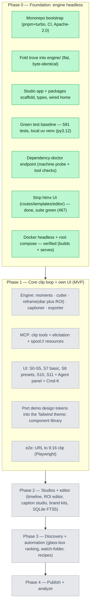

# Spool — build progress

> **Living tracker. Read this first to resume.** Maintained as work proceeds, mapped to
> `Spool_Engineering-Spec.md` (§5 roadmap, §6 front-end standards). Status legend:
> ✅ done & verified · 🟡 in progress · ◻️ not started.
>
> **Last updated:** 2026-06-02 · **Phase 0 (foundation) — ✅ COMPLETE.** Next: Phase 1 (core clip loop + UI).

## Roadmap at a glance



## Phase 0 — Foundation (current)

- [x] **Monorepo bootstrap** — pnpm + turbo workspace, strict TS, Prettier, GitHub Actions CI, Apache-2.0. `pnpm install`+`typecheck`+`build` green. *(commit `58f5763`)*
- [x] **Fold trove → `engine/`** — flat layout intact, verified **byte-identical** to validated upstream; `engine/clip/` Phase-1 scaffolds; clipify back-half vendored + renamed + MIT-credited (`THIRD_PARTY_LICENSES.md`).
- [x] **Studio + packages** — real Next.js 16 app; `@spool/types` (full data model, spec §3), `api-client`, `mcp-client`, `ui`; home screen wired to the engine. *(fix `d788686`: health() shape)*
- [x] **whisper.cpp standard** — already the only transcription dep (`pywhispercpp`); no `openai-whisper` to remove.
- [x] **Progress stream** — already exists: `GET /api/v1/events` (SSE, jobs + transcripts snapshots).
- [x] **Green test baseline** — **591 tests pass** (whole trove suite) on Python 3.12 via a local **uv venv**. Docker got corrupted by a full disk and was reset; the dev/test loop is now the local venv (seconds per run, vs Docker's 14-min rebuilds). Docker packaging is deferred to B6.
- [x] **Dependency-doctor endpoint** — `GET /api/v1/doctor` (unauthenticated): `machine.probe()` + ffmpeg / yt-dlp / whisper.cpp / Python presence & versions + available ffmpeg encoders. Test + OpenAPI contract entry; verified in the 591-test run.
- [x] **Strip the htmx UI** — removed `templates/`, `static/`, `styles/`, `tailwind.config.js`, `routes/transcript_editor.py`, the inline HTML/`*-card`/transcribe-setup/transcript-view routes in `app.py`, `_card_view`, the htmx jinja globals + editor `txn_locks`, and 7 obsolete htmx test files. Preserved the `app.extensions["trove.actions"]` helpers `api_v1` needs; trimmed now-dead imports. **Migrated** `test_transcribe_pipeline.py` to drive the real pipeline via `POST /api/v1/jobs/<id>/transcribe` (was the removed HTML route) so coverage isn't lost. CSP coverage confirmed in `test_safety.py`. Also fixed a pre-existing trove test race (`test_cancel_from_paused_removes_partial_files`) the suite reordering exposed. **Suite green: 467 passed, exit 0.**
- [x] **De-couple Docker** — `engine/Dockerfile` rewritten **multi-stage** (builder compiles webrtcvad's C ext with build-essential + python3-dev; lean runtime carries ffmpeg + libgomp1 + libsndfile1, copies the installed prefix); `trove.sh` headless (drops Tailwind; installs `requirements.txt`); root `docker-compose.yml` (host-bind + token + `PYTHONUNBUFFERED`, persisted models volume, host-owned downloads) + `engine/.dockerignore`. **Verified:** `docker compose up` builds the image and serves `/api/v1/health` → `{ok, v1}` both inside the container and from the host (`0.0.0.0:8899`). The container needs ~5–15 s to load whisper.cpp on first start; the cold build is a one-time ~14 min torch install (layer-cached after).

**Phase 0 done-when:** from a clean checkout, the engine runs headless → POST a URL to `api_v1` → file downloads with live progress → transcribe yields `words.json` + `.srt`; the same flow works from Claude Desktop via the MCP server; no htmx anywhere.

## Phase 1 — Core clip loop + UI (in progress)

Engine clip modules first (TDD, matching trove's ffmpeg/job conventions), then `api_v1`
clip endpoints + clip/render job types, then MCP clip tools + elicitation, then the
studio screens wired to `api_v1` with the demo's design tokens ported in.

- [x] **`cutter`** — lossless `ffmpeg -c copy` trim (input-seek + duration), cancel/
  error-handled like `transcriber.extract_audio`. 7 tests, green.
- [x] **`captioner`** — slices `words.json` to the clip window (re-based to 0) → styled
  ASS (opus/karaoke/minimal) via the vendored `ass_captions`; `burn` rasterizes via
  ffmpeg's subtitles filter. Shared ffmpeg plumbing extracted to `clip/_ffmpeg.py`
  (cutter refactored onto it; reframe/exporter will reuse it). 6 tests.
- [x] **`reframe`** — `detect_faces` (sample frame + default L/R ROIs) + `speaker_track`
  (per-ROI ffmpeg motion → vendored `roi_motion` → **diar⊕ROI fusion**, still/off-mic
  speakers resolved by audio turns) + `render` (pan via vendored `pan_expr`, split, center;
  9:16/16:9/1:1/4:5). 15 tests.
- [ ] ◻️ **`moments`** — LLM moment-finding over `words.json` (local Ollama default,
  hosted opt-in per spec §10).
- [x] **`exporter`** — platform presets (tiktok/reels/shorts/linkedin/x/youtube) →
  codec/bitrate/fps + -14 LUFS loudnorm, hardware encoder (VideoToolbox/NVENC/x264),
  fast-vs-quality. Brand kits deferred to P2. 9 tests.
- [ ] ◻️ **`api_v1` clip endpoints + clip/render job types** (extend `JobManager`).
- [ ] ◻️ **MCP clip tools** + elicitation + `spool://` resources.
- [ ] ◻️ **Studio screens** (S0–S5, S7 basic, S8 presets, S10, S11) wired to `api_v1`;
  port the demo's design tokens; Agent panel + ⌘K. e2e: URL → 9:16 clip.

## What's verified now

- `pnpm install` → 6 workspace projects, 354 packages, clean.
- `pnpm typecheck` → 9/9 tasks pass. `pnpm build` → Next.js 16 compiles, static pages generate.
- `engine/` `.py` files diff byte-identical against the validated trove clone.
- **engine: 504 tests pass** (exit 0) on Python 3.12 via uv venv — headless trove suite (467) + `clip.cutter` (7) + `clip.captioner` (6) + `clip.reframe` (15) + `clip.exporter` (9).
- **`docker compose up`** builds the multi-stage image and serves `/api/v1/health` from the host — the packaged engine works end to end.
- **headless serving** (venv): `/api/v1/doctor` reports real tooling — ffmpeg 7.1.1, whisper.cpp 1.5.0, yt-dlp 2026.3.17, VideoToolbox encoders.

## How to resume (cold start)

```bash
# JS workspace
pnpm install
pnpm dev            # studio → http://localhost:3000 (shows engine status)
pnpm typecheck && pnpm build

# engine (Python 3.11+; local default is 3.9 → use the uv venv)
cd engine
uv venv --python 3.12               # if .venv is missing (uv auto-fetches 3.12)
uv pip install -r requirements.txt  # heavy once: torch, pywhispercpp, yt-dlp@master, …
.venv/bin/pytest -q                 # full suite, ~60s
```

Spec: `docs/Spool_Engineering-Spec.md` (§5 phases, §6 front-end). Visual source of truth: `docs/Spool (standalone) (1).html`.

## Locked decisions

- License **Apache-2.0**; diarization kept in **core install** (heavier base, no missing-dep step).
- Engine = flat fold-in of trove (reuse, don't rebuild); htmx stripped in Phase 0, not at bootstrap.
- **Dev/test loop = local uv venv (Python 3.12)**, not Docker. Docker is reserved for packaging (B6) and was reset after a full-disk corruption.
- Internal TS packages export raw source; Next `transpilePackages` compiles them.
- TS types are currently idealized (camelCase); **Phase-1 wiring reconciles them with the real `api_v1` shape** (snake_case; `/api/v1/openapi.json` can seed generation).

## Open / deferred

- Docker was reset (empty image) after the disk filled; B6 (Dockerfile de-coupling + compose) needs Docker Desktop working again — verify a clean `docker build engine/` then.
- `Spool_Design-Brief.md` and `Spool_Design-Review.md` are referenced by the spec but **absent**; proceeding from the demo + §6.6 carried review items.
- Reclip MIT attribution: confirm before launch whether any reclip source was copied into trove (spec §7.3).
